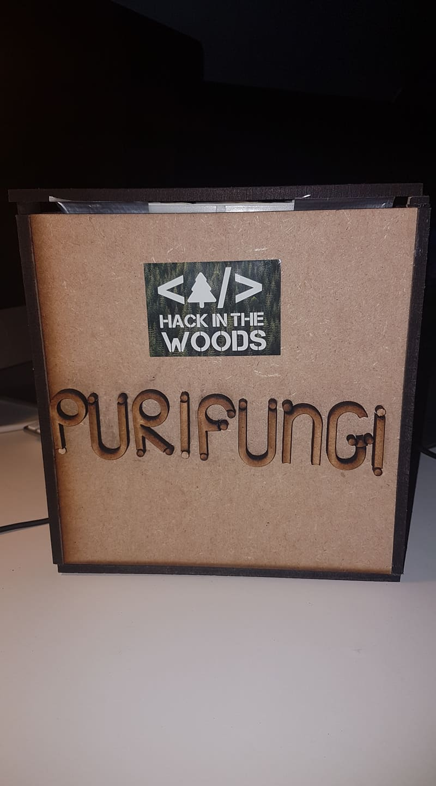
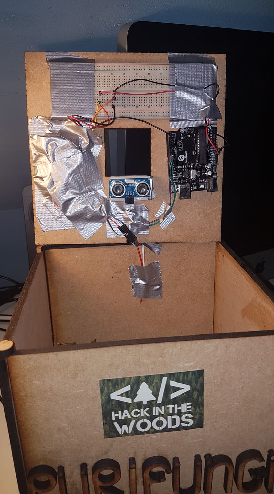
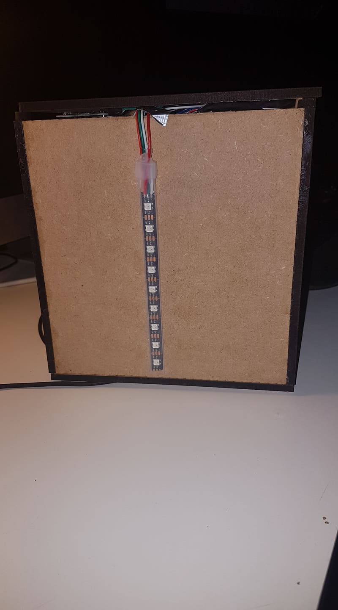

# Connected Ashtray

## What is it?

This is a Connected Ashtray that count the number of cigarette in multiple ashtray linked in a webpage that track in live the stat of each ashtray.
The goal is to sensitize people *(mainly in festivals)* to the ecological impact of butts drop no the floor.
We also added led outside the box to track the filling of the ashtray. So the staff can easly see when they have to empty them, and people can easly see where are the ashtray while the nigth.

We was working with Puripungi. This is a society that recycle the butts in recycle material with mushrooms.

## Why?
This project was made While the **Hack In The Wood** *vol.2*. 

## Contriutors:
- [Maxim Berge](https://www.linkedin.com/in/maxim-berge-94b486179/) **-> Electronic + Backend**
- [Cassandra Caestecker](https://www.linkedin.com/in/cassandra-caestecker/) **-> Design + FrontEnd**

*And a special thanks to [Vincent De Gheyndt](https://www.linkedin.com/in/vincent-de-gheyndt/).
But also to [Bertrand Marlair](https://www.linkedin.com/in/bertrand-marlair/), an amazing coach that helped us break the dead ends!*

## Repo:

The repo is divided in 3 parts:

- [**Web UI**](./Web-UI)
- [**Arduino Server**](./Server-Arduino)
- [**Arduino code**](./Arduino-code)

## Pictures:

